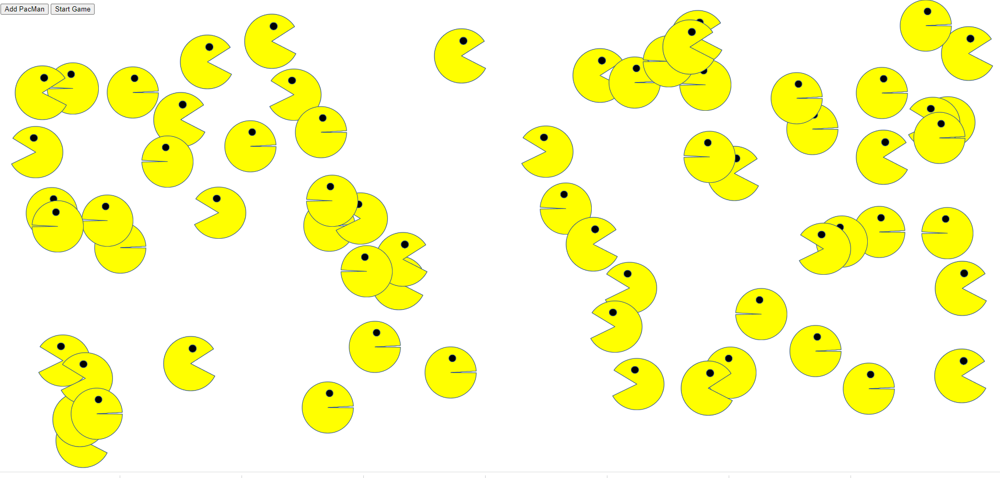

# PacmanFactory
Replication "factory" that creates X number of cloned Pacmen
<!--Expanded upon by Philip Case based on an MIT XPro class exercise June 2022-->

<h2>Stepwise Run Actions Required:</h2>

1. Click buton at top titled:  "Add Pac-Man" (once or many times)
2. Press "Start Game" button to see images of the Pacmen appear and move
3. If you want to add more - clit button titled: "Add Pac-Man"
4. This program includes the use of HTML, CSS and Javascript
5. The Document Object Model DOM is utilized
6. Velocity and direction randomly generated using Math.random
7. When the Pacmen reach the page limit - the Pacmen will bounce and reverse direction

<h2>Roadmap Run:</h2>

1. Add sound elements
2. Add Zombie Pacmen
3. Develope 3D Pacmen
4. Include Ms. PacWoman
5. Create user to control (keyboard/mouse) for directional control of the first Pacman made

<h2>License Discolures:</h2>
MIT Licence

